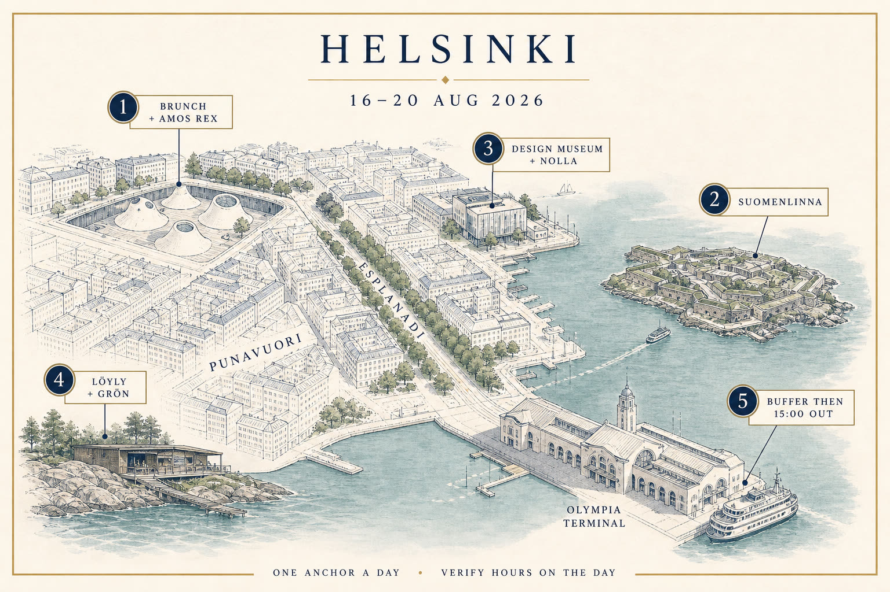
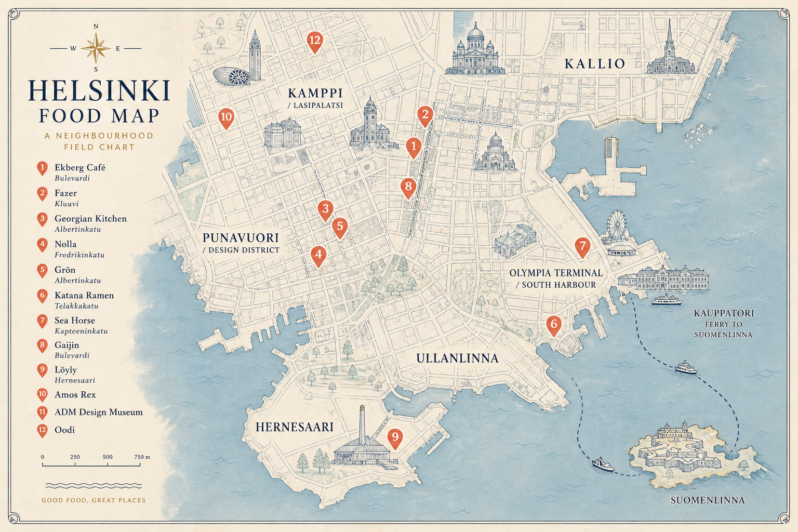
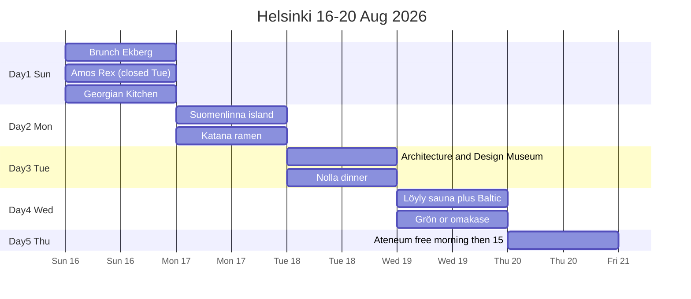
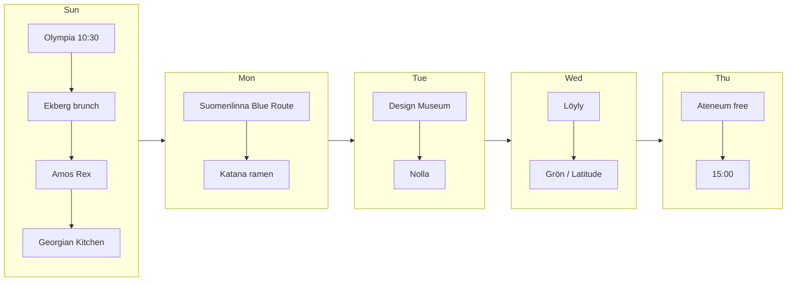

# Helsinki · 16–20 Aug 2026

**Arrive:** Silja Symphony · Olympia Terminal · **Sun 16 Aug ~10:30**  
**Leave:** **Thu 20 Aug 15:00** — confirm on **your** ticket whether that is airport or another ship. This file does not guess.

**Open this first on a phone:** [helsinki-visual.html](helsinki-visual.html)  
**Workbook:** [Helsinki-16-20-Aug-2026.xlsx](Helsinki-16-20-Aug-2026.xlsx)  
**Rebuild:** `python3 docs/helsinki-aug-2026/build_workbook.py`  
**Sources:** [research/restaurants-verified.md](research/restaurants-verified.md) · [research/neighbourhood-eateries.md](research/neighbourhood-eateries.md) · [research/activities-verified.md](research/activities-verified.md)

Hours and prices were read from official pages on **15 Aug 2026**. They move. Cells marked `*` or VERIFY are not official-hours claims.

**Thesis:** fortress island · underground museum · sauna on the sea · Georgian table · one Nordic kitchen if a table exists.

Night of the Arts is **Thu 20 Aug evening**. You leave at 15:00. Do not rearrange.

---

## Book before you sleep on the ship

Do these in order. Stop when the night is locked.

| # | What | When | Link |
|---|---|---|---|
| 0 | **Ekberg brunch** | Sun 16 ~11:30 | [ekberg.fi table reservation](https://www.ekberg.fi/en/cafe/table-reservation) — official brunch Sat–Sun **09:00–14:30** |
| 1 | **Georgian Kitchen** | Sun ~19:00 | [georgiankitchen.fi](https://www.georgiankitchen.fi/) · Albertinkatu 7 · Sun **13–22** · +358 50 383 3228 |
| 2 | **Nolla** | Tue 18 dinner | [restaurantnolla.com/reservations](https://restaurantnolla.com/reservations/) |
| 3 | **Grön** | Wed 19 only | [DinnerBooking](https://dinnerbooking.com/fi/en-US/r3904/restaurant-gron) · official summer menu **188e** |
| 3b | **Skörd** | Wed (also Mon–Tue) | [TableOnline](https://www.tableonline.fi/en/helsinki/skord/1001/book) · official **86e** / Mon–Thu **72e** |
| 3c | **Kuurna** | Mon 17 (Nolla closed) | [kuurna.fi](https://www.kuurna.fi/in-english) · 2/3 courses from **46e/54e** |
| 4 | **Löyly** 2 h public sauna | Wed 19 afternoon | [reservation calendar](https://varaus.asio.fi/onlinekalenteri/loyly/guest.php?ss_lang=eng) · official **€29 / 2 h** |
| 5 | **Gaijin** backup | Sun from 15:00 | [gaijin.fi/reservation](https://www.gaijin.fi/reservation) · Bulevardi 6 |
| 6 | **Latitude 25 / Shii** | Wed only (closed Sun–Tue) | [latitude25.fi](https://www.latitude25.fi/) · [shii.fi](https://shii.fi/) |
| 7 | HSL app | all week inc Suomenlinna ferry | [hsl.fi Suomenlinna](https://www.hsl.fi/en/travelling/visitors/suomenlinna) |
| 8 | Amos Rex | Sun before 17:00 | [tickets](https://amosrex.fi/en/tickets/) · 18–29 / students **€5** official |

**Closed while you are here (do not fight):**

- **Amos Rex → Tuesday 18 Aug**
- **Nolla → Sun + Mon** (Michelin listing; confirm in the booker)
- **Grön → Sun + Mon + Tue**
- **Latitude 25 → Sun + Mon + Tue** (official)
- **Kosmos → Sunday**
- **Katana Ramen → Sunday likely** (Falstaff omits Sunday — VERIFY)
- **Momotoko ramen → permanently closed** (bankruptcy 2025)
- **Wino → closed 1 Jun–3 Sep 2026**; **Restaurant Kuu → closed from 1 Jul**; **Adzika → no current premises**; **Satkar Kamppi → now Sansar**

---

## First meal (this sets the city)

Walk off the ship. Do **not** eat in the terminal.

1. **Ekberg Café**, Bulevardi 9 — ~15 min through Design District. Oldest café. Summer café **Sun 9–18** (official **9.8–6.9.2026**). **Brunch Sun 9:00–14:30**. Book the table.
2. **Karl Fazer Café**, Kluuvikatu 3 — the 1891 room. **Sun 10–20**. Weekend brunch is advertised; sitting hours are not printed — VERIFY.
3. **Levain Merikortteli**, Pursimiehenkatu 29–31 — official Sat–Sun 8:30–16:30 if the institutions are slammed.

**Café Regatta is too far** for a tired 10:30 arrival.

---

## Four days

**Sun civic:** Oodi is **Sat–Sun 10–20** (weekdays 8–21). Easy after Rex.

**Mon island:** HSL ferry from the **east side of Kauppatori**, ~15 min, route 19. AB ticket (adult single listed **€3.30** on 15 Aug — VERIFY). Optional English tour 10:30 / 12:30 / 14:30, **€16**, [book](https://suomenlinna.johku.com/en_US/liput/guided-walking-tour-in-english). Self-guided Blue Route is enough.

**Sun Georgian:** **Georgian Kitchen** over Rioni. Same dishes: khachapuri, khinkali, amber wine.

**Tue:** Rex is closed. ADM at Korkeavuorenkatu 23 (square construction from 3 Aug 2026; doors still open). Lunch: **Levain Ullanlinna** next door, daily 8–16.

**Wed:** Löyly, Hernesaarenranta 4. Official sauna Wed **9–11 and 13–22**. Swimwear in mixed saunas. Then Grön if you got the table.

**Thu 15:00:** **Ateneum is free 10:00–20:00** this day — only if your departure mode allows. If **ferry**, use your ticket's boarding rule. If **airport**, leave with your real transfer time.

---

## Restaurants — the short list

| Must | Place | Why |
|---|---|---|
| 10 | **Ekberg brunch** | First impression. Official Sunday brunch. Bookable. |
| 10 | **Nolla** | Zero-waste Nordic, Bib Gourmand — your “better than AG under a star bill” |
| 10 | **Georgian Kitchen** | The cuisine you named. Family. Open Sunday. |
| 9 | **Grön** | Official summer menu **188e**. Your only night is Wednesday. |
| 9 | **Skörd** | Official **86e** seven-course / **72e** Mon–Thu four-course. Finnish ingredients only. The rational splurge. |
| 9 | **Amos Rex / Suomenlinna / Löyly / ADM** | The four place-anchors |
| 8 | **Katana Ramen** Telakkakatu 12 | Dedicated ramen after Momotoko died. Likely closed Sunday. |
| 8 | **Sea Horse** Kapteeninkatu 11 | 1933 Finnish room; onion steak; open 15–24 |
| 8 | **Gaijin** | Serious North-Asia; Sun from 15:00; lunch closed through 17 Aug |
| 7 | **Latitude 25 / Shii** | Omakase — Wednesday only for Latitude (official) |
| 7 | **Kosmos / Sansar / BasBas** | 1924 Helsinki cuisine (closed Sun) · Kamppi Nepalese lunch · Punavuori small plates Tue–Wed |
| 6 | **Cella / Harju 8 / Lohtu** | Kallio classic (hours only through Mon 17) · walk-in wine room · vegan Hakaniemi lunch (hall closed Sun) |
| 6 | **Bui Ramen** | Real handmade noodles — Kalasatama, not central. Paitan **17.90€** official. |
| 0 | **Momotoko** | Closed. Do not go. |

**Skip:** Savotta, Zetor, cathedral-square “Finnish experience”, sushi buffets, SkyWheel lunch, food tours, second island.

---

## Activities — the short list

| Do | Don’t as a day |
|---|---|
| Amos Rex, ADM, Oodi, Suomenlinna, Löyly | Temppeliaukio, Senate Square loop, Seurasaari, food tours |
| HSL ferry (city ticket) | A second island |
| Optional: Ateneum free Thursday morning | Architecture walking tour Thu 15:00 (you are leaving) |
| Optional: Aalto House Tue guided visit (Munkkiniemi, €32 / students €16) | Paying €310 for a private architecture walk |
| Optional: authorised Suomenlinna English tour | Paying €310 for a private architecture walk |

---

## Rain

Swap island ↔ museum days. Löyly still works in rain (it’s the point). Do not add a church.

---

## Uncertainty

Restaurant hours move. Gaijin lunch was closed **22 Jun–17 Aug 2026**; **Tue 18** lunch may be back — check. Nolla hours are not on the official homepage. Katana has no official hours page. Grön/Nolla/omakase prices shift. Löyly swim is weather-dependent. Departure mode on Thu is on **your** ticket, not this file.
